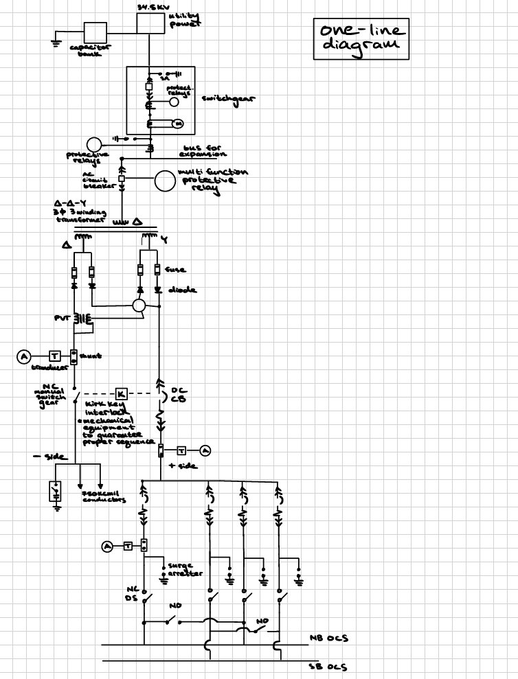
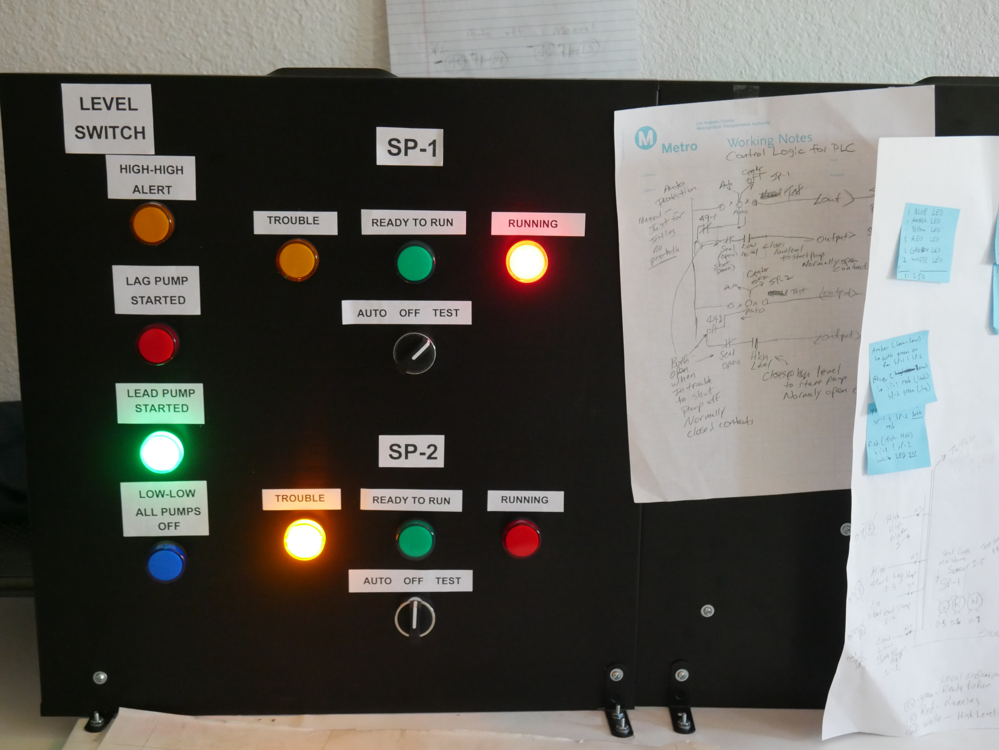
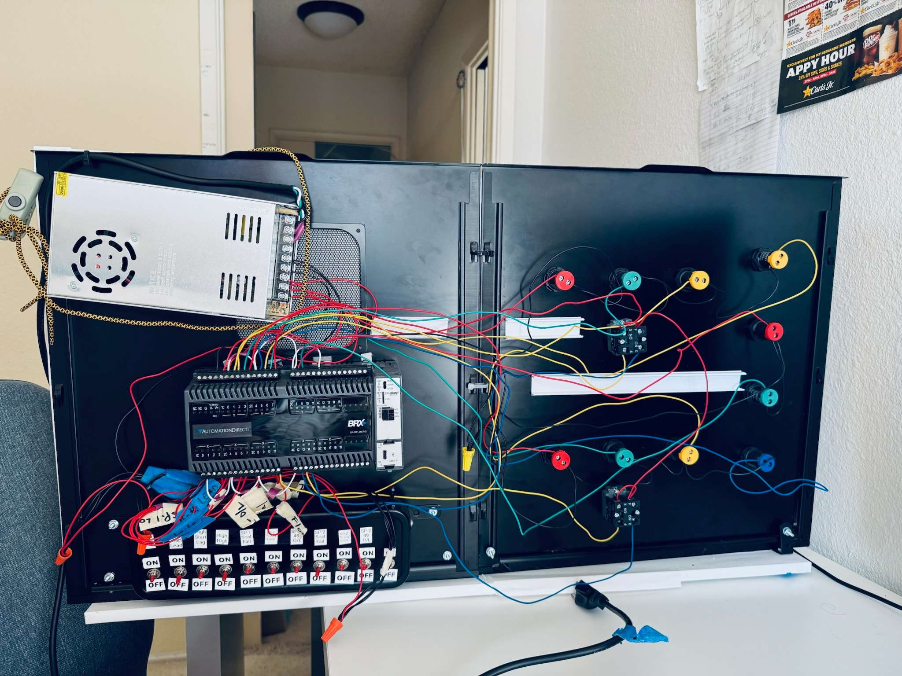
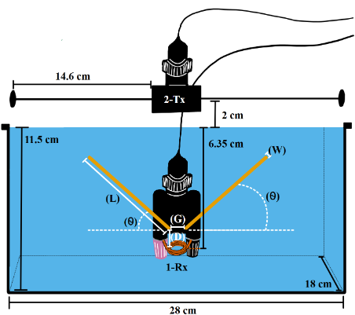
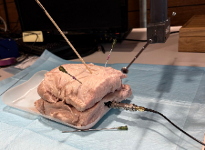

<!--Section 1: Introduce yourself-->
## ABOUT ME

Hello! I'm Charles Langer. I'm a senior Electrical Engineering student at the University of Utah, graduating in December 2026, 
with an emphasis in power engineering and a 3.85 GPA.  I'm particularly interested in power systems, controls, and electrical design. 

Through my coursework, research, and hands-on projects, I've gained hands-on experience designing a traction power substation, developing and tuning PID controllers in MATLAB, and designed, wired, and programmed a functional control panel prototype for a sump pump system. These experiences have strengthened my ability to take a system requirement and turn it into a practical solution.  

I enjoy taking a problem, understanding how the system needs to operate, and turning that into a practical electrical solution. I’m looking for an opportunity where I can apply my engineering skills, gain more hands-on experience, and contribute to real-world power or controls projects.

## MY PORTFOLIO
*A glimpse of some of the projects I was talking about.*

**A One-Line Diagram of the Traction Power Substation I helped to design.**

How power flows and relay protections

<a href ="UTA Trax TPSS.pdf"> [Read More] </a>

**Control Panel Project.**

Here is the front end of the control panel

Here is the back end of the control panel

---

**Senior Project - Implantable Antennas.** 

As implantable medical devices become smaller with advances in battery technology, mm-scale antennas face challenges in wireless signal transmission and reception. This project investigates injectable, passive, flexible focusing antennas designed to improve RF signal coupling. We optimized antenna diameter, length, angle, tip gap, and spacing from the receiving coil and evaluated performance in saline solution and pork tissue to approximate human biological environments.

**Saline solution setup used to find optimized antenna parameters**

**Pork tissue setup used to evaluate optimized antenna**

<a href ="Implantable Antenna Power Point.pdf"> Learn more about this project.</a>

**PID Controller**

Developed a PID Controller

<a href ="Controls Design Part 2.pdf"> [Read More] </a>

##CONTACT ME

📧 **Email:** [charleslanger999@gmail.com](mailto:charleslanger999@gmail.com)  
📱 **Phone:** [(747) 255-9982](tel:+17472559982)  
📍 **Location:** Salt Lake City, UT  
📍 **Location:** Burbank, CA  
💼 **LinkedIn:** [Charles Langer](https://www.linkedin.com/in/charles-langer-67a765217)   
📄 **Resume:** <a href ="Charles Langer Resume rev3 (5th Year).pdf"> View my CV </a>

